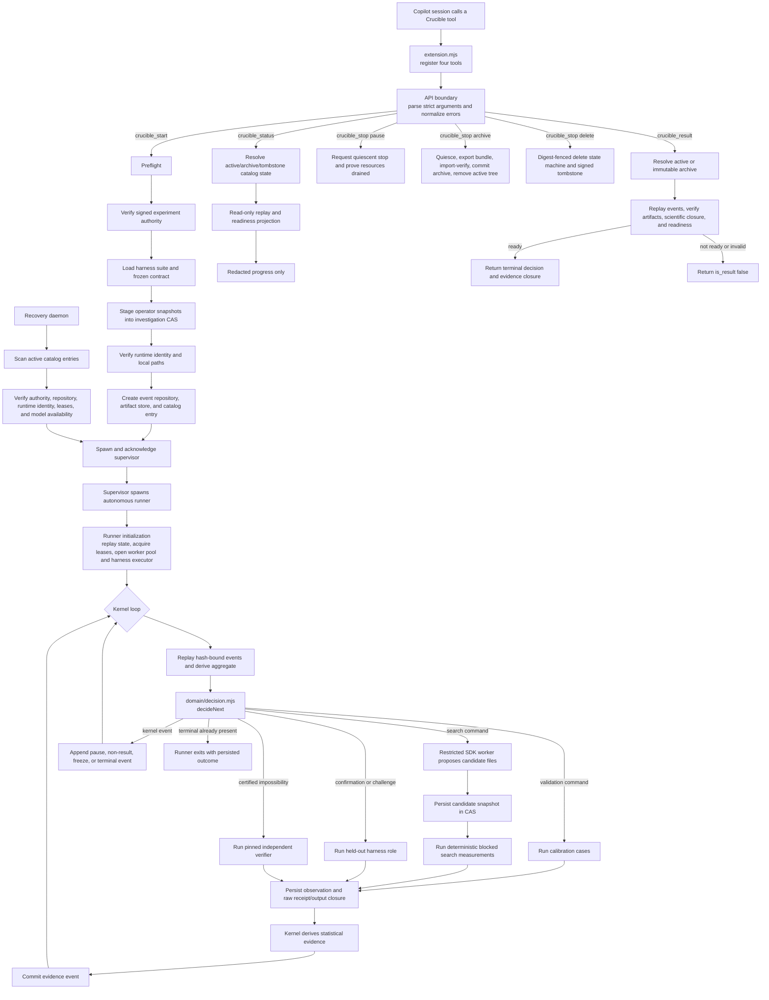

# Crucible source audit and workflow

This report was reconstructed from the production source graph after a
32-lane audit. It describes the current implementation, not the historical
README design.

## What Crucible does

Crucible runs an operator-authorized experiment in which restricted Copilot
workers propose candidate file sets and an operator-selected harness measures
them. A deterministic domain kernel owns search progression, statistical
decisions, confirmation, terminalization, and non-result decisions. The public
surface contains exactly four tools:

- `crucible_start` starts or reattaches an investigation.
- `crucible_status` reports lifecycle and progress without exposing a result.
- `crucible_stop` pauses, archives, or deletes an investigation.
- `crucible_result` is the only tool allowed to return a terminal conclusion.

## End-to-end workflow

## Start and admission

Source path:

`extension.mjs` -> `api/handlers.mjs` -> `api/preflight.mjs`

Preflight verifies the configured experiment registry and detached signature,
constructs the frozen contract, validates the harness suite and operator corpus,
stages required snapshots, resolves local runtime dependencies, and computes the
deterministic investigation identity. Apply then creates the event repository,
artifact store, runtime configuration, and resource-catalog record before asking
`runtime/extension-adapter.mjs` to start an acknowledged supervisor.

The worker never receives general shell or filesystem tools. Its primary output
is a bounded `crucible_submit_candidate` call containing candidate files and
annotations.

## Runner and kernel

Source path:

`runtime/supervisor.mjs` -> `runtime/runner.mjs` ->
`runtime/domain-adapter.mjs` -> `domain/decision.mjs`

The runner does not decide scientific outcomes itself. On each iteration it:

1. Maintains the working set and storage accounting.
2. Replays the repository into a deterministic domain aggregate.
3. Returns immediately for a persisted terminal, pause, or non-result.
4. Calls `decideNext(aggregate)`.
5. Appends a kernel-authored event or executes the requested command.
6. Persists the command observation and commits kernel-derived evidence.
7. Repeats until a persisted outcome exists.

Current command families are calibration, candidate search, held-out
confirmation, held-out challenge, and certified-impossibility verification.

## Candidate evaluation

Source path:

`runtime/worker-pool.mjs` -> `runtime/runner.mjs` ->
`measurement/executor.mjs` -> `domain/statistics.mjs`

A candidate proposal becomes a content-addressed snapshot. The runner creates a
deterministic blocked-replication schedule and executes the frozen search
harness against candidate and control arms. Raw stdout, stderr, receipts,
snapshots, schedules, and observations are persisted before the kernel derives
claim states.

Search does not stop merely because one candidate passes. The domain maintains
an archive of candidate outcomes, selects search operators and parents, detects
plateau/escape conditions, and compares supported candidates using frozen metric
priority and confidence bounds.

When discovery stops, the kernel freezes the provisional candidate or tie
cohort and schedules fresh confirmation and challenge measurements. A positive
terminal result requires the resulting scientific closure to satisfy readiness;
otherwise Crucible records a non-result.

For a finite certified-impossibility experiment, exhaustive refutation is not
enough by itself. The runner also executes the pinned independent verifier and
binds its request, output, receipt, proof artifact, and coverage closure.

## Persistence and replay

Source path:

`persistence/repository.mjs`, `persistence/artifact-store.mjs`,
`runtime/domain-adapter.mjs`, and `persistence/bundle.mjs`

The SQLite repository stores the event chain and operational journals. Large
objects live in a content-addressed artifact store. Domain replay verifies event
hashes, reducer transitions, artifact references, and recomputed scientific
state. Cached summaries are not result authority.

Archive creates a self-contained bundle, imports and verifies the staged bundle,
commits the resource-catalog transition, and only then removes active state.
Archived databases are read immutably. Delete is digest-fenced and finishes with
a signed tombstone that prevents recreation of the same investigation identity.

## Recovery and process ownership

Source path:

`runtime/recovery-daemon.mjs`, `runtime/extension-adapter.mjs`,
`runtime/supervisor.mjs`, and `runtime/process-identity.mjs`

Recovery scans only active catalog records. Before restarting work it verifies
the experiment authority, repository integrity, runtime identity, resource
capacity, SDK authentication, and frozen model availability.

Supervisor and runner ownership is bound to executable, command line, and
process start identity rather than PID alone. A stale PID therefore cannot
authorize termination of an unrelated process.

## Lifecycle tools

| Tool | Actual authority |
|---|---|
| `crucible_start` | Admit signed configuration, create or reattach state, and ensure an acknowledged supervisor |
| `crucible_status` | Read lifecycle and replay-derived progress; never return a decision |
| `crucible_stop` | Request quiescence, archive a verified bundle, or digest-fence deletion |
| `crucible_result` | Verify replay, artifacts, scientific closure, and readiness before returning a terminal |

## Removed abandoned code

The audit removed more than 11,000 lines from the working change, including:

- event and resource-catalog migrations for state that does not exist;
- legacy domain, receipt, bundle, task, and archive compatibility;
- unused inline/projection persistence formats;
- orphan SDK probe and enumerand-staging modules;
- redundant measurement-scheduler facade;
- dead runner reuse methods and unused repository/adapter APIs;
- unused recovery-task controls and recovery-operation ledger;
- an entire novelty-measurement subsystem that was required and replayed but
  never scheduled or produced by the runner;
- stale tests and fixtures for the deleted behavior.

## Remaining audit findings

These are live issues, not abandoned code:

- Held-out confirmation/challenge currently gates acceptance claims but does not
  independently rescore sealed predictions.
- Statistical progress can use a narrower alpha allocation than final evidence
  evaluation, which can allow an early stop followed by unresolved final claims.
- Working-set admission does not probe actual free disk space, and the default
  global storage ceiling is effectively nonrestrictive.
- Per-effect storage reservation can be lower than the maximum output, receipt,
  and CAS bytes written by one measurement.
- macOS/BSD process identity capture is unavailable, so supervised launch is
  effectively Windows/Linux only.

These require behavioral design changes rather than deletion and were left
intact.

## Source map

| Responsibility | Primary source |
|---|---|
| Tool registration and boundary | `extension.mjs`, `api/handlers.mjs`, `api/schema.mjs` |
| Admission and authority | `api/preflight.mjs`, `api/experiment-authority.mjs`, `api/experiment-registry.mjs` |
| Domain state machine | `domain/events.mjs`, `domain/reducer.mjs`, `domain/decision.mjs` |
| Statistics and readiness | `domain/statistics.mjs`, `domain/scientific-replay.mjs`, `domain/scientific-readiness.mjs` |
| Candidate workers | `runtime/worker-pool.mjs` |
| Orchestration | `runtime/runner.mjs`, `runtime/supervisor.mjs` |
| Measurement boundary | `measurement/executor.mjs`, `measurement/harness-suite.mjs` |
| Event and artifact persistence | `persistence/repository.mjs`, `persistence/artifact-store.mjs` |
| Bundles and lifecycle | `persistence/bundle.mjs`, `api/lifecycle.mjs` |
| Recovery | `runtime/recovery-daemon.mjs`, `runtime/process-identity.mjs` |
